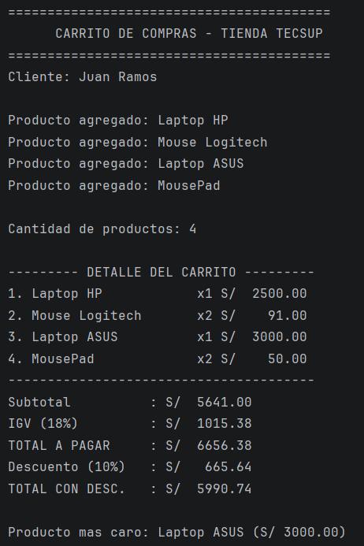
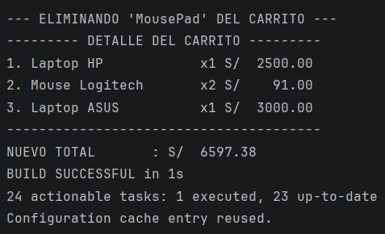

¿por qué nombre y precio son
- nombre y precio son val porque son datos fijos del producto que 
no deben cambiar durante la compra.
- cantidad es var porque el usuario puede modificar cuántas unidades llevará.

¿Qué pasaría si intentas cambiar el precio después de crear el producto?
- Da un error de compilación (Val cannot be reassigned), ya que las propiedades 
val son de solo lectura.

Laboratorio 02 - Carrito de Compras Kotlin

Nombre: Juan Diego Ramos Enriquez
Curso: Programación en Móviles

Descripción:
Programa en Kotlin que simula un carrito de compras. Calcula 
subtotal, IGV (18%), total y aplica descuentos según el monto. También 
permite eliminar productos y mostrar el detalle del carrito.

Funciones: 
calcularSubtotal, calcularIGV, calcularTotal, calcularDescuento, 
mostrarDetalle, buscarProducto.

Captura de consola

val vs var:
val es una referencia inmutable, no se puede reasignar. var 
es mutable. Uso val para datos fijos como subtotal, igv y total, y 
var para cantidad, que puede cambiar, y el contador i del bucle.