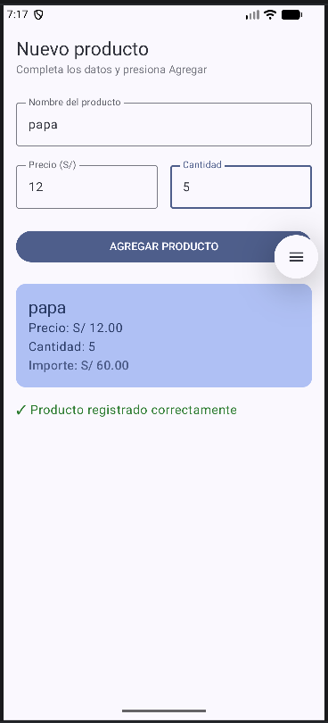
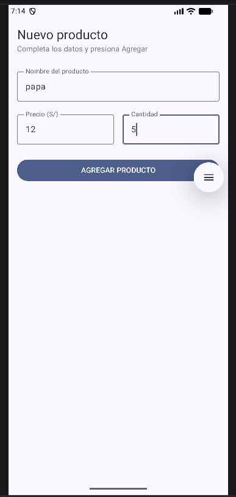

Pantalla inicial

app resultado 

Lab03 - Registro de Producto

Nombre: Juan Diego Ramos Enriquez

Descripcion:
El funcionamiento de mi app, primero pongo el nombre de mi producto luego el precio
y la cantidad y al agregar mi producto lo que me mostrara sera 
el producto el precio la cantidad y el importe que sera la multiplicacion de
el precio con la cantidad

Capturas

Pantalla inicial:

Despues de presionar:

Reflexión: ¿Qué pasa sin remember?
Sin remember, la app pierde el estado en cada recomposición. 
Al presionar una tecla, la variable se reinicia a su valor 
por defecto (""), impidiendo que el usuario pueda escribir.

Reflexión: ¿Por qué se borran los datos al girar la pantalla?
Al girar el teléfono ocurre un cambio de configuración que destruye 
y vuelve a crear la Activity. Como remember solo conserva los datos 
mientras la pantalla no se destruya, la información se pierde. Para 
solucionarlo se usa rememberSaveable, el cual guarda el estado en un 
Bundle y permite conservar los datos tras la rotación.