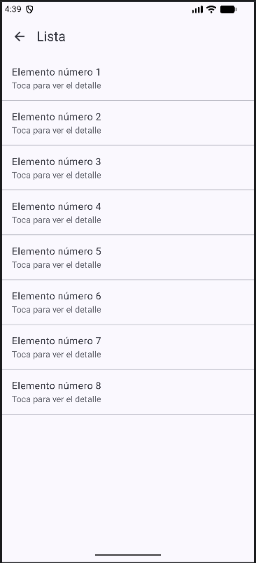
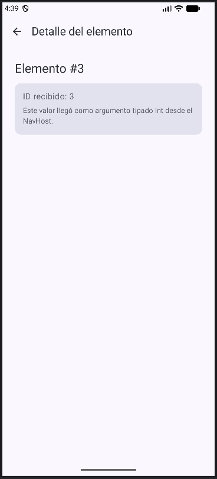
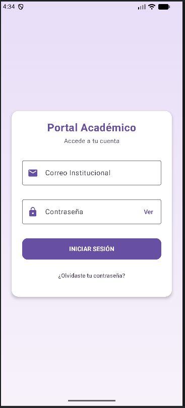
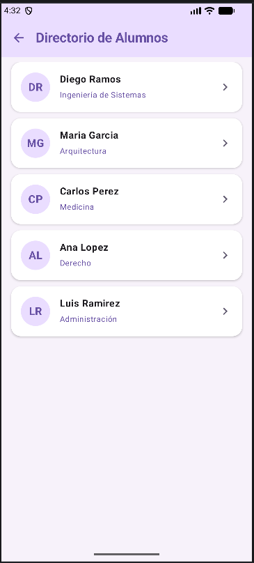
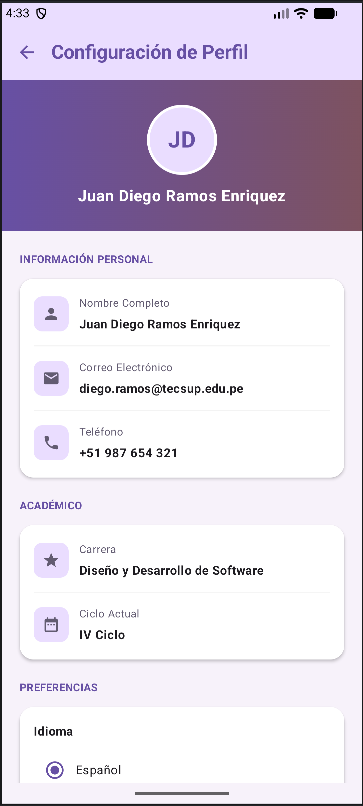

# Semana 05 – Navegación en Jetpack Compose

**Alumno:** Juan Diego Ramos Enriquez · **Docente:** Juan León S. · **Guía:** `GLAB-S05-JLEONS-2026-2.pdf`

---

## Parte 1 – Navegación según la guía (sin IA)

App de 4 pantallas con **Navigation Compose**: rutas con `sealed class`, `NavHost` y paso de argumento tipado (`NavType.IntType`) de la Lista al Detalle.

```
Home ──► Lista ──► Detalle (itemId: Int)
  └────► Perfil ──► Home (popUpTo inclusive)
```

> Además de `navigation-compose:2.7.7` se agregó `material-icons-core:1.7.8`, necesaria para el ícono de la flecha atrás.

| Inicio | Lista | Detalle | Perfil |
|:---:|:---:|:---:|:---:|
|  |  |  |  |

---

## Parte 2 – Mejora con prompt (con IA – Gemini)

Rediseño como **Portal Académico**: login con validación, bienvenida, directorio de alumnos, expediente académico y perfil con cambio de idioma (Español / English).

> **Para ingresar:** cualquier correo válido y contraseña de 6 caracteres o más (ej. `diego.ramos@tecsup.edu.pe` / `123456`).

### Prompt utilizado

```text
# ROL
Actúa como un desarrollador Android senior experto en Kotlin, Jetpack Compose y Material 3. Escribe código limpio, que compile a la primera y listo para copiar y pegar.

# CONTEXTO DEL PROYECTO
- Paquete: com.tecsup.semanaapp
- Carpetas actuales: navigation/ (Screen.kt, AppNavigation.kt), screens/ (HomeScreen.kt, ListScreen.kt, DetailScreen.kt, ProfileScreen.kt) y ui/theme/ (Color.kt, Theme.kt, Type.kt)
- Rutas con sealed class Screen(val route: String) y NavHost en AppNavigation.kt
- MainActivity usa enableEdgeToEdge() y llama a AppNavigation() dentro de SemanaAppTheme { }
- Dependencias instaladas: navigation-compose 2.7.7 y material-icons-core 1.7.8
- Usa rutas String. NO uses navegación type-safe con @Serializable.
- NO tengo material-icons-extended. Usa SOLO estos íconos:
  • Icons.Default: Email, Lock, Person, Phone, Home, Info, Star, Face, DateRange, AccountBox, AccountCircle
  • Icons.AutoMirrored.Filled: ArrowBack, ExitToApp, KeyboardArrowRight, List
- No agregues librerías nuevas (nada de Coil ni imágenes de internet). Las fotos se reemplazan por un círculo con las iniciales del nombre.

# OBJETIVO
Rediseñar la app como un "Portal Académico" de 5 pantallas, con el siguiente estilo visual y contenido.

# ESTILO VISUAL
- Morado primario #6750A4, lavanda claro #EADDFF, fondo #F7F2FA, texto oscuro #1D1B20, gris #625B71, rojo #B3261E.
- Tarjetas con esquinas redondeadas de 16.dp y sombra suave (elevation 2-4.dp).
- Avatares: círculo con las iniciales (ej. "MG" para Maria Garcia) sobre fondo lavanda #EADDFF y texto morado, con borde blanco cuando va sobre un banner.
- Títulos en negrita, subtítulos y carreras en morado, etiquetas pequeñas en gris.
- En ui/theme/Theme.kt pon dynamicColor = false y primary = #6750A4, para que los colores no cambien según el fondo de pantalla del celular.

# PANTALLAS

P1 – LoginScreen ("Portal Académico"):
- Fondo con degradado vertical lavanda (#E8DEF8 arriba a #F7F2FA abajo) que cubra toda la pantalla.
- Card centrada con título "Portal Académico" (morado, negrita, grande) y subtítulo "Accede a tu cuenta".
- OutlinedTextField "Correo Institucional" con ícono Email.
- OutlinedTextField "Contraseña" con ícono Lock, PasswordVisualTransformation y botón de texto "Ver"/"Ocultar" al final.
- Botón ancho morado "INICIAR SESIÓN" y debajo el texto "¿Olvidaste tu contraseña?".
- VALIDACIÓN OBLIGATORIA (no dejar entrar sin datos):
  • Correo vacío → error "Ingresa tu correo".
  • Correo con formato inválido (usa android.util.Patterns.EMAIL_ADDRESS) → error "Correo no válido".
  • Contraseña vacía → error "Ingresa tu contraseña".
  • Contraseña con menos de 6 caracteres → error "Mínimo 6 caracteres".
  • Muestra cada error debajo de su campo con isError = true y supportingText en rojo. Los errores se muestran al tocar el botón y se limpian cuando el usuario corrige el campo.
  • Solo si todo es válido, navega a Home con popUpTo(Screen.Login.route) { inclusive = true }.

P2 – HomeScreen (Bienvenida):
- Fondo con degradado vertical de #6750A4 (arriba) a #F7F2FA (abajo) que cubra TODA la pantalla, incluida la barra de estado.
- Texto centrado, blanco, negrita y grande en dos líneas: "Bienvenido," / "Diego Ramos".
- Debajo: "¿Qué deseas gestionar hoy?" en blanco semitransparente.
- Dos tarjetas blancas anchas, cada una con un ícono dentro de un cuadrado lavanda redondeado, título en negrita y subtítulo gris:
  • "Directorio de Alumnos" – "Ver y gestionar estudiantes" (ícono AutoMirrored List) → navega a StudentList.
  • "Mi Perfil Académico" – "Datos personales y progreso" (ícono Person) → navega a Profile.
- Abajo del todo, centrado: botón de texto rojo "Cerrar Sesión Segura" con ícono AutoMirrored ExitToApp → vuelve al Login con popUpTo(0) { inclusive = true }.

P3 – StudentListScreen ("Directorio de Alumnos"):
- TopAppBar con fondo lavanda #EADDFF, título "Directorio de Alumnos" en morado oscuro y flecha atrás.
- LazyColumn con una Card por alumno: avatar con iniciales, nombre en negrita, carrera en morado debajo, y flecha AutoMirrored KeyboardArrowRight a la derecha.
- Alumnos de ejemplo (en este orden):
  1. Diego Ramos – Ingeniería de Sistemas
  2. Maria Garcia – Arquitectura
  3. Carlos Perez – Medicina
  4. Ana Lopez – Derecho
  5. Luis Ramirez – Administración
- Al tocar un alumno navega a su expediente pasando su id como Int (NavType.IntType) con Screen.StudentDetail.createRoute(id).

P4 – StudentDetailScreen ("Expediente Académico"):
- TopAppBar con título "Expediente Académico" y flecha atrás.
- Banner morado (degradado de #6750A4 a #4F378B) con esquinas inferiores redondeadas de 32.dp.
- Avatar grande (≈110.dp) con borde blanco, centrado y SOBRESALIENDO del banner (la mitad dentro del banner y la otra mitad fuera).
- Debajo: nombre en negrita grande y carrera en morado.
- Card lavanda claro con filas (ícono morado + etiqueta pequeña gris + valor en negrita):
  • ID Estudiante (ícono AccountBox) – ej. 2024-0001
  • Correo Electrónico (ícono Email) – ej. diego.ramos@example.com
  • Facultad (ícono Home) – ej. Ingeniería y Tecnología
  • Un divisor y luego "Biografía" en negrita con un texto corto, ej. "Estudiante destacado con interés en desarrollo Android."
- Cada alumno tiene sus propios datos. Si el id no existe, mostrar "Alumno no encontrado".

P5 – ProfileScreen ("Configuración de Perfil"):
- TopAppBar con título "Configuración de Perfil" y flecha atrás.
- Banner con degradado horizontal de #6750A4 a #7D5260, con avatar circular con borde blanco y debajo "Juan Diego Ramos Enriquez" en blanco negrita.
- Sección "INFORMACIÓN PERSONAL" (título pequeño, morado, mayúsculas) con filas (ícono gris dentro de un cuadrado lavanda + etiqueta pequeña + valor):
  • Nombre Completo – Juan Diego Ramos Enriquez (ícono Person)
  • Correo – diego.ramos@tecsup.edu.pe (ícono Email)
  • Teléfono – +51 987 654 321 (ícono Phone)
- Sección "ACADÉMICO":
  • Carrera – Diseño y Desarrollo de Software (ícono Star)
  • Ciclo Actual – IV Ciclo (ícono DateRange)
- Sección "PREFERENCIAS":
  • Idioma: dos RadioButton "Español" / "English". Al elegir uno, TODA la app cambia de idioma al instante (ver CAMBIO DE IDIOMA).
- Al final, botón ancho "Cerrar Sesión" con fondo rojo claro #F9DEDC, texto e ícono AutoMirrored ExitToApp en rojo #B3261E → vuelve al Login con popUpTo(0) { inclusive = true }.

# CAMBIO DE IDIOMA (debe funcionar de verdad)
- Crea ui/Strings.kt con un data class AppStrings que contenga TODOS los textos visibles de la app (títulos, botones, etiquetas, subtítulos y mensajes de error), y dos instancias: SpanishStrings y EnglishStrings.
- En AppNavigation.kt guarda el idioma elegido con rememberSaveable y provéelo a toda la app con un CompositionLocal (LocalAppStrings).
- Todas las pantallas usan LocalAppStrings.current en lugar de textos fijos.
- No traducir nombres propios ni datos de ejemplo (nombres, correos, teléfonos, carreras e IDs).
- No uses AppCompatDelegate ni agregues librerías.

# REGLAS TÉCNICAS
1. Usa rememberSaveable { mutableStateOf() } para campos de texto, errores, idioma y visibilidad de contraseña.
2. Usa Scaffold en cada pantalla. El color o degradado de fondo debe aplicarse con containerColor del Scaffold o ANTES de .padding(innerPadding), para que no queden franjas blancas arriba ni abajo.
3. Agrega @OptIn(ExperimentalMaterial3Api::class) donde uses TopAppBar.
4. Comentarios breves solo en las partes clave (navegación, paso del argumento, validación, idioma).
5. No cambies MainActivity salvo que sea necesario; si lo cambias, mantén SemanaAppTheme { AppNavigation() }.

# FORMATO DE RESPUESTA
Entrega archivos completos, uno por bloque de código con el nombre del archivo arriba:
- navigation/Screen.kt (Login, Home, StudentList, StudentDetail con createRoute(id: Int), Profile)
- navigation/AppNavigation.kt (startDestination = Login, con el CompositionLocal del idioma)
- data/Student.kt (data class Student y la lista de 5 alumnos de ejemplo)
- ui/Strings.kt (AppStrings, SpanishStrings, EnglishStrings y LocalAppStrings)
- components/StudentComponents.kt (StudentAvatar con iniciales e InfoRow reutilizables)
- screens/LoginScreen.kt, HomeScreen.kt, StudentListScreen.kt, StudentDetailScreen.kt, ProfileScreen.kt
- ui/theme/Theme.kt (dynamicColor = false, primary #6750A4)
Al final, una lista corta de archivos a CREAR, REEMPLAZAR y ELIMINAR (ListScreen.kt y DetailScreen.kt deben eliminarse, no dejarse vacíos).
```

### Capturas

| Login vacío | Login con datos | Correo sin @ |
|:---:|:---:|:---:|
|  |  |  |

| Bienvenida | Directorio de Alumnos | Expediente Académico |
|:---:|:---:|:---:|
|  |  |  |

| Perfil | Preferencias (idioma) |
|:---:|:---:|
|  |  |

---

**Ramas:** `semana05/Rama-manual-pdf` (Parte 1, unida a `main`) · `semana05/Rama-implementacion-prompt` (Parte 2)
